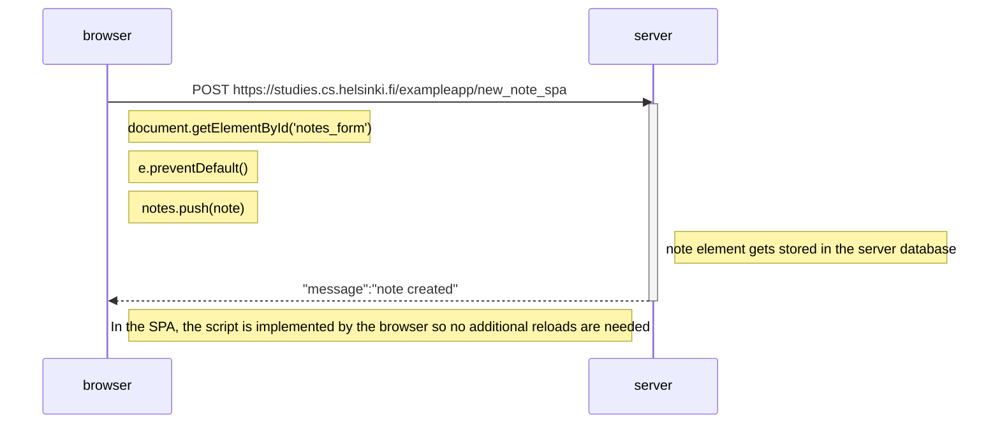

```mermaid
sequenceDiagram
    participant browser
    participant server
    
    browser->>server: POST https://studies.cs.helsinki.fi/exampleapp/new_note_spa
    activate server
    Note right of browser:  document.getElementById('notes_form')
    Note right of browser:  e.preventDefault()
    Note right of browser: notes.push(note)
    Note right of server: note element gets stored in the server database
    server-->>browser: "message":"note created"
    deactivate server
    
    Note right of browser: In the SPA, the script is implemented by the browser so no additional reloads are needed
```
